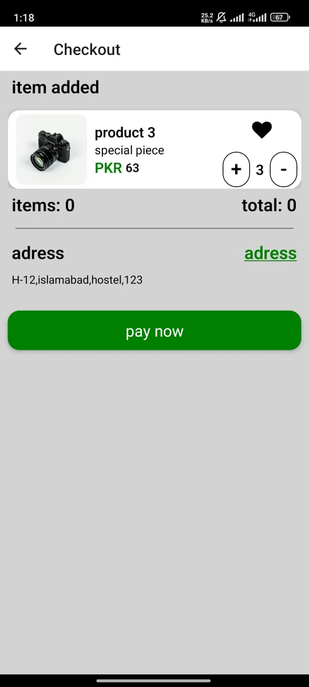
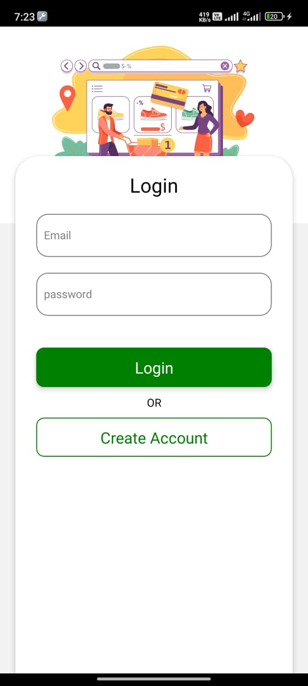
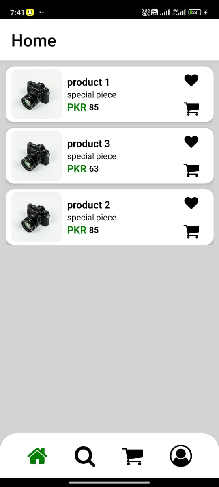
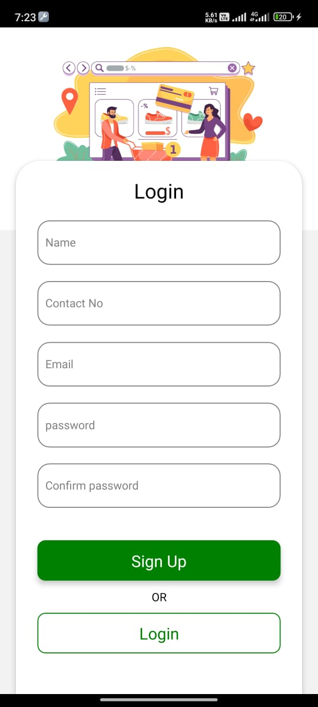
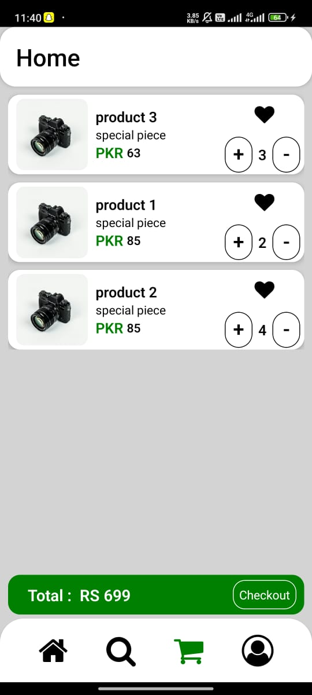
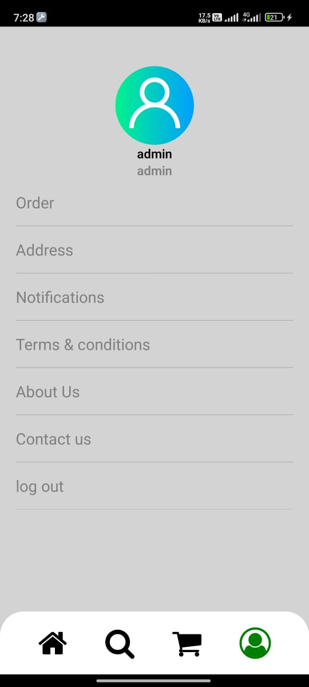

# Seamless Shopping Experience with React Native E-Commerce App

Welcome to our cutting-edge e-commerce application built from scratch using React Native. Delve into a seamless shopping experience where clients can effortlessly browse, add items to their cart, and proceed to checkout with ease.

## Introduction

Our e-commerce application offers a modern and intuitive interface, providing users with a smooth and enjoyable shopping journey. With a focus on usability and performance, we aim to redefine the mobile shopping experience.

## Features

- **Effortless Browsing**: Intuitive navigation allows users to seamlessly browse through a wide range of products.
- **Cart Management**: Users can easily add items to their cart, adjust quantities, and remove items as needed.
- **Secure Checkout**: A secure checkout process ensures the safety of users' personal and payment information.
- **Real-time Updates**: Integration with Firebase Firestore enables real-time updates for product availability and order status.
- **Authentication**: Firebase Authentication ensures a secure login process, providing a personalized experience for each user.

## Tools Used

- **React Native**: Utilized for building a cross-platform mobile application with a native-like experience.
- **Firebase Firestore**: Used for storing and managing product data, orders, and user information.
- **Firebase Authentication**: Implemented for secure user authentication and authorization.
- **React Native Style Library**: Employed for efficient and consistent styling across the application.

## Screenshots

  
  
  
  
  
  
  

